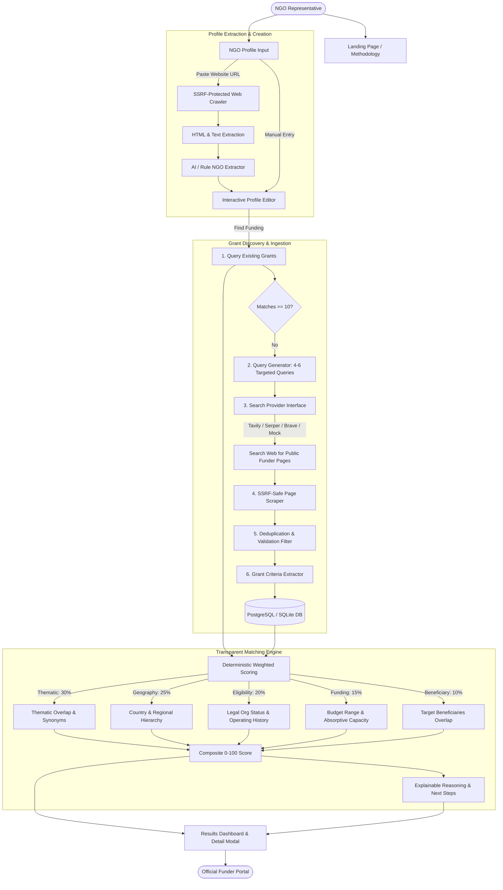

# GrantMatch AI

> **Open-source AI-powered grant discovery and matching platform for NGOs.**

GrantMatch AI is a free web platform built for non-governmental organizations, grassroots civil society initiatives, and international development non-profits. It automatically discovers, evaluates, and ranks public funding opportunities based on an NGO’s precise mission, operating geography, target beneficiaries, funding size, and institutional eligibility criteria.

Instead of depending solely on expensive or stale static grant databases, GrantMatch AI combines an internal self-improving grant repository with a live public web discovery pipeline that queries funder pages, parses open calls for proposals, verifies criteria, and calculates transparent, explainable compatibility scores.

---

## The Problem & The Solution

### The Problem
- **Information Asymmetry:** Grassroots and Global South NGOs spend hundreds of hours browsing fragmented donor portals, aggregators with paywalls, and outdated directories.
- **Hidden Ineligibility:** Organizations waste weeks preparing applications only to be disqualified on obscure criteria (e.g., minimum operating history, specific legal entity types, or geographic exclusions).
- **Opaque "AI Magic":** Many modern AI tools act as black boxes, hallucinating non-existent grant deadlines or calculating arbitrary compatibility numbers without evidence.

### The Solution
- **Transparent Multi-Factor Scoring:** Every grant match shows a deterministic 5-factor breakdown (Thematic, Geographic, Eligibility, Funding Size, Beneficiaries) plus plain-English compliance warnings.
- **Evidence-Backed & Zero Hallucination:** Every grant opportunity must have an active, validated public source URL.
- **Self-Improving Discovery Layer:** Queries official funder domains (foundations, bilateral agencies, multilateral development banks) and stores discovered grants so the dataset continuously improves.
- **Zero-Key Demo Mode:** Runs completely out of the box without requiring paid external API keys.

---

## Architecture Overview



---

## Matching Methodology

GrantMatch AI uses a deterministic, transparent weighted scoring model:

$$\text{Composite Score} = 0.30 \cdot S_{\text{theme}} + 0.25 \cdot S_{\text{geo}} + 0.20 \cdot S_{\text{elig}} + 0.15 \cdot S_{\text{fund}} + 0.10 \cdot S_{\text{beneficiary}}$$

| Dimension | Weight | Description & Rules |
| :--- | :---: | :--- |
| **Thematic Fit** | **30%** | Semantic taxonomy mapping across sectors (Education, Healthcare, Climate, Human Rights, Agriculture, etc.). |
| **Geographic Fit** | **25%** | Evaluates country and regional hierarchies (e.g. Kenya $\to$ East Africa $\to$ Sub-Saharan Africa $\to$ Global). **Disqualification rule:** If geographic fit is $0\%$, overall match is capped at $25\%$. |
| **Organization Eligibility** | **20%** | Checks legal registration status against eligible types and verifies minimum operating history requirements (e.g. funder requires 3+ years). |
| **Funding-Size Fit** | **15%** | Compares requested funding bracket against grant min/max. Flags grants that exceed 2.5x the NGO's annual operating budget. |
| **Beneficiary Fit** | **10%** | Compares target demographic groups (e.g. Adolescent Girls, Smallholder Farmers, Indigenous Peoples, Displaced Persons). |

Language models (OpenAI, Anthropic, or Gemini) are used strictly for criteria extraction, resolving nuanced conditions, and generating actionable next steps—not as an opaque replacement for the math.

---

## Core Features

- **Automated NGO Website Scraping:** Paste your homepage URL; our SSRF-protected crawler parses your mission, programs, and geography to prepopulate your profile.
- **Pluggable Search Providers:** Seamlessly switch between Tavily, Google Serper, Brave Search, or the built-in offline mock provider.
- **SSRF Defense Layer:** Hardened with DNS pre-resolution, private IP blocklists (RFC1918, link-local, cloud metadata), and strict redirect inspection.
- **Anonymous Usage & Rate Limiting:** Free for end users without mandatory signups; includes configurable token bucket rate limits per IP.
- **Institutional Civic Tech UI:** High-contrast, clean layout designed for professional donors, civil society leaders, and policy professionals.

---

## Quick Start (Local Development)

### 1. Clone & Install
```bash
git clone https://github.com/your-username/grantmatch-ai.git
cd grantmatch-ai
npm install
```

### 2. Configure Environment
```bash
cp .env.example .env
```
*(The default `.env` is configured for zero-key local operation using SQLite and the Mock discovery provider!)*

### 3. Initialize Database & Seed
```bash
npm run db:push
npm run db:seed
```

### 4. Start Development Server
```bash
npm run dev
```
Open [http://localhost:3000](http://localhost:3000) in your browser.

---

## Environment Variables Reference

| Variable | Default | Purpose |
| :--- | :--- | :--- |
| `DATABASE_URL` | `file:./dev.db` | PostgreSQL connection string for production, or SQLite file path for local dev. |
| `APP_URL` | `http://localhost:3000` | Canonical URL of the application. |
| `OPENAI_API_KEY` | *(optional)* | OpenAI API key for GPT-4o-mini extraction & explanations. |
| `ANTHROPIC_API_KEY` | *(optional)* | Anthropic API key for Claude 3.5 Haiku. |
| `GEMINI_API_KEY` | *(optional)* | Google Gemini API key for Gemini 1.5 Flash. |
| `SEARCH_PROVIDER` | `mock` | Web search provider: `mock`, `tavily`, `serper`, or `brave`. |
| `SEARCH_API_KEY` | *(optional)* | API key for the chosen live search provider. |
| `RATE_LIMIT_PER_DAY` | `3` | Maximum live web searches per IP per day for anonymous users. |
| `MAX_URLS_PER_DISCOVERY` | `20` | Cap on URLs scraped during a single discovery cycle. |

---

## Deploying to Railway

GrantMatch AI is pre-configured for one-click deployment on [Railway](https://railway.app):

### Step 1: Create a Railway Project
1. Create a new project on Railway.
2. Add a **PostgreSQL** database service.
3. Add a **GitHub Repo** deployment service pointing to this repository.

### Step 2: Configure Environment Variables in Railway
Set the following environment variables in the service dashboard:
- `DATABASE_URL`: `${{Postgres.DATABASE_URL}}`
- `NODE_ENV`: `production`
- `SEARCH_PROVIDER`: `mock` (or `tavily` / `serper` with your key)
- `SEARCH_API_KEY`: *(your search key)*
- `OPENAI_API_KEY`: *(optional OpenAI key)*

### Step 3: Run Seed on First Deploy
Once deployed, run the initial seed from the Railway CLI or web console:
```bash
npx prisma db push
npx ts-node prisma/seed.ts
```

The application health check is available at `/api/health`.

---

## Testing & Quality Verification

Run the comprehensive unit and integration test suite:
```bash
npm test
```

Verify the production build:
```bash
npm run build
```

---

## Product Roadmap

- [ ] **User Accounts & Saved Profiles:** Secure login for NGOs to manage multiple organizational profiles.
- [ ] **Automated Grant Alerts:** Scheduled weekly email notifications for newly discovered funding opportunities.
- [ ] **Concept Note & Application Drafting Assistant:** Context-aware drafting tool generating tailored concept notes.
- [ ] **Collaborative Team Workspace:** Multi-user commenting, pipeline status tracking, and deadline calendars.
- [ ] **Donor CRM Integrations:** Sync matching grants directly to Salesforce, HubSpot, or Airtable.
- [ ] **Multilingual Discovery:** Search in Spanish, French, Arabic, and Portuguese for regional funding calls.
- [ ] **Grant Application Readiness Score:** Organizational diagnostic evaluating audited accounts, policies, and governance maturity.
- [ ] **Impact Reporting Integration:** Post-award milestone tracking and donor reporting templates.
- [ ] **Developer API:** REST and GraphQL APIs for civil society network platforms and umbrella associations.

---

## License

GrantMatch AI is licensed under the [MIT License](LICENSE).
